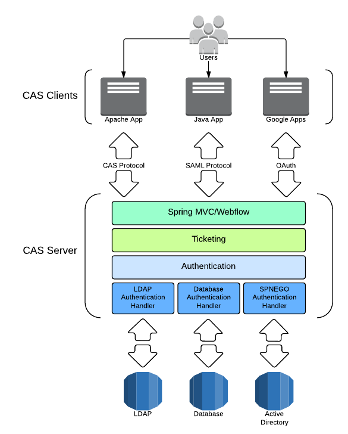
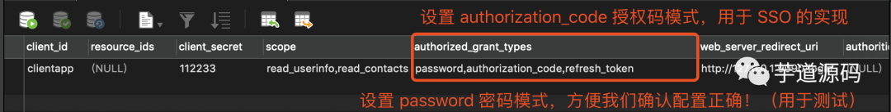
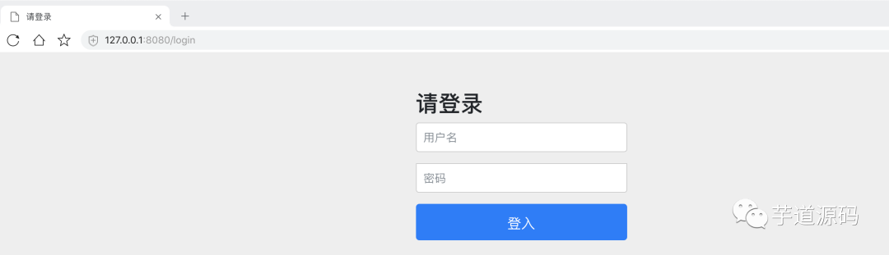
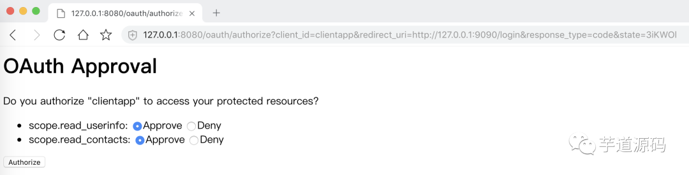
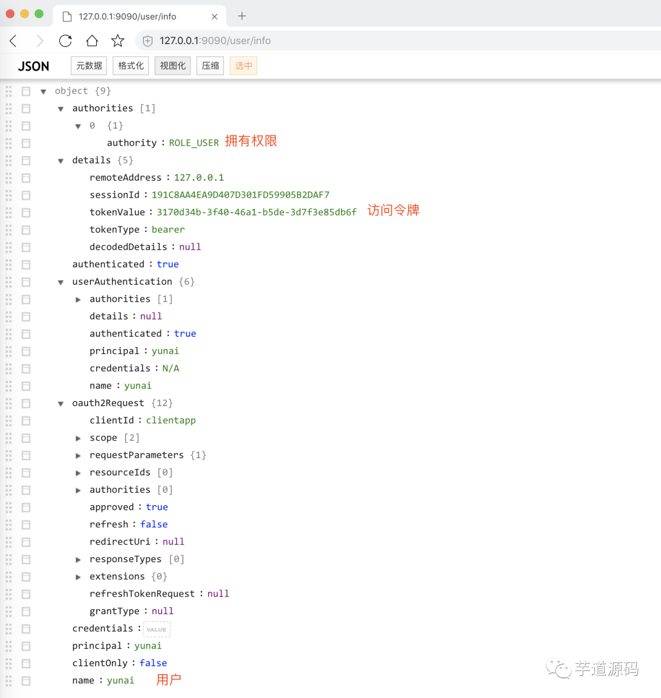
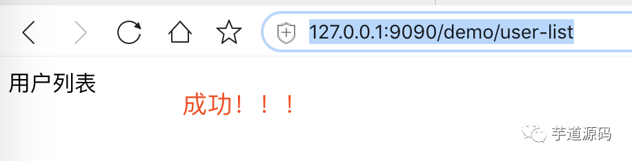
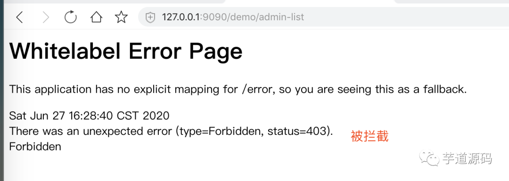
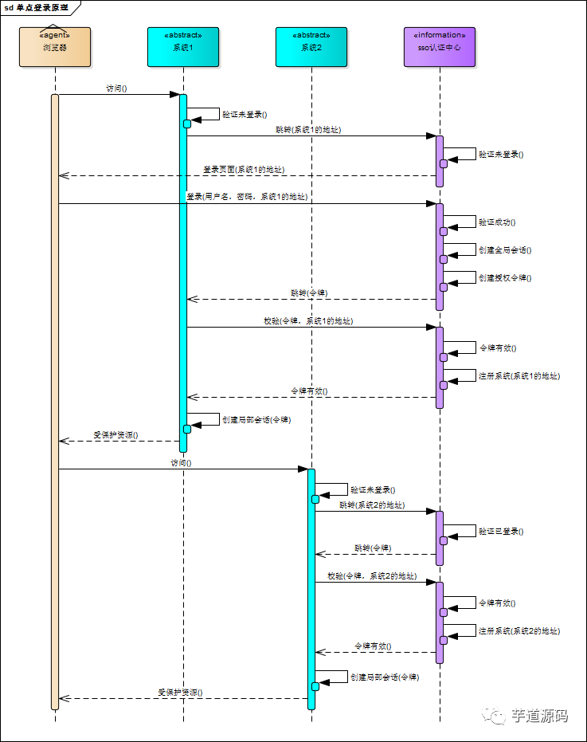

一个简单的CAS-SSO系统的demo

[toc]


# 一个简单的SSO单点系统demo
>代码是基于 《写了一个SSO 单点登录的代码示例给胖友！》(https://cloud.tencent.com/developer/article/1654876)进行的修改
# 1.主要技术栈

> springboot+Springsecurity + OAuth2
>
> 模拟了CAS的单点系统。主要包含认证系统 authserverdemo和 登录系统 resoucedemo
>
>  其中 认证系统 authserverdemo 类似服务端，登录系统 resoucedemo是客户端
>
> 注意本文采取的是datasource验证
# 2.了解OAUTH认证授权原理
OAUTH认证授权就三个步骤，三句话可以概括：
> 1. 获取未授权的Request Token
> 2. 获取用户授权的Request Token
> 3. 用授权的Request Token换取Access Token 
>   当应用拿到Access Token后，就可以有权访问用户授权的资源了。

大家可能看出来了，这三个步骤不就是对应OAUTH的三个URL服务地址嘛。
> > 上面的三个步骤中，每个步骤分别请求一个URL，并且收到相关信息，并且拿到上步的相关信息去请求接下来的URL直到拿到Access Token。 
> 
> 具体每步执行信息如下：

- A. 使用者（第三方软件）向OAUTH服务提供商请求未授权的Request Token。
  向Request Token URL发起请求，请求需要带上的参数。 

- B. OAUTH服务提供商同意使用者的请求，并向其颁发未经用户授权的oauth_token与对应的oauth_token_secret，并返回给使用者。

- C. 使用者向OAUTH服务提供商请求用户授权的Request Token。向User Authorization URL发起请求，请求带上上步拿到的未授权的token与其密钥。

- D. OAUTH服务提供商将引导用户授权。该过程可能会提示用户，你想将哪些受保护的资源授权给该应用。此步可能会返回授权的Request Token也可能不返回。如Yahoo OAUTH就不会返回任何信息给使用者。

- E. Request Token 授权后，使用者将向Access Token URL发起请求，将上步授权的Request Token换取成Access Token。这个比第一步A多了一个参数就是Request Token。

- F. OAUTH服务提供商同意使用者的请求，并向其颁发Access Token与对应的密钥，并返回给使用者。

- G. 使用者以后就可以使用上步返回的Access Token访问用户授权的资源。

  > 从上面的步骤可以看出，用户始终没有将其用户名与密码等信息提供给使用者（第三方软件），从而更安全。
  >
  > 用OAUTH实现背景一节中的典型案例：当服务B（打印服务）要访问用户的服务A（图片服务）时，通过OAUTH机制，服务B向服务A请求未经用户授权的Request Token后，服务A将引导用户在服务A的网站上登录，并询问用户是否将图片服务授权给服务B。用户同意后，服务B就可以访问用户在服务A上的图片服务。整个过程服务B没有触及到用户在服务A的帐号信息

# 3.具体的步骤-数据库
> 提示现在是在做认证系统就是CAS的服务端

> - 3.1创建数据库+执行sql
>
>   > ① 执行 oauth_schema.sql 脚本，创建数据库表结构。
>   >
>   > > ```
>   > > oauth_client_details
>   > > oauth_client_token
>   > > oauth_access_token
>   > > oauth_refresh_token
>   > > oauth_code
>   > > oauth_approvals
>   > > ```
>   >
>   > ② 执行 oauth_data.sql 脚本，插入一个客户端记录。
>   >
>   > ```sql
>   > INSERT INTO oauth_client_details
>   > (client_id, client_secret, scope, authorized_grant_types,
>   >  web_server_redirect_uri, authorities, access_token_validity,
>   >  refresh_token_validity, additional_information, autoapprove)
>   > VALUES
>   >     ('clientapp', '112233', 'read_userinfo,read_contacts',
>   >      'password,authorization_code,refresh_token', 'http://127.0.0.1:9090/login', null, 3600, 864000, null, true);
>   > -- 注意！这条记录的 web_server_redirect_uri 字段，我们设置为 http://127.0.0.1:9090/login，这是稍后我们搭建的 XXX 系统的回调地址。
>   > 
>   > ```
>   >
>   > 
>   >
>   > 注意！这条记录的 web_server_redirect_uri 字段，我们设置为 http://127.0.0.1:9090/login，这是稍后我们搭建的 XXX 系统的回调地址。(可以根据需求改成你想要的地址)

> > 统一登录系统采用 OAuth 2.0 的授权码模式进行授权。
> > 授权成功后，浏览器会跳转 http://127.0.0.1:9090/login 回调地址，然后 XXX 系统会通过授权码向统一登录系统获取访问令牌。
> > 通过这样的方式，完成一次单点登录的过程。
> > 4.
> >
> > > 还有一个用户表，一个权限表
> > >
> > > ```sql
> > > DROP TABLE IF EXISTS `authorities`;
> > > CREATE TABLE `authorities` (
> > >     `username` varchar(50) NOT NULL,
> > >     `authority` varchar(50) NOT NULL,
> > >     UNIQUE KEY `ix_auth_username` (`username`,`authority`)
> > >     ) ENGINE=InnoDB DEFAULT CHARSET=utf8;
> > > 
> > > DROP TABLE IF EXISTS `users`;
> > > CREATE TABLE `users` (
> > >     `username` varchar(50) NOT NULL,
> > >     `password` varchar(500) NOT NULL,
> > >     `enabled` tinyint(1) NOT NULL,
> > >     PRIMARY KEY (`username`)
> > >     ) ENGINE=InnoDB DEFAULT CHARSET=utf8;
> > > 
> > > INSERT INTO `authorities` VALUES ('yunai', 'ROLE_USER');
> > > 
> > > INSERT INTO `users` VALUES ('yunai', '112233', '1');
> > > 
> > > ```
> > >
> > > 

# 4.具体步骤-认证系统
## 4.1SecurityConfig（提供用户认证的功能）

创建 SecurityConfig 配置类，通过 Spring Security 提供用户认证的功能。


> ```java
> @Configuration
> @EnableWebSecurity
> public class SecurityConfig extends WebSecurityConfigurerAdapter {
>     //注意本方法已经被弃用了
> 
>     /**
>      * 数据源 DataSource
>      */
>     @Autowired
>     private DataSource dataSource;
> 
>     @Override
>     @Bean(name = BeanIds.AUTHENTICATION_MANAGER)
>     public AuthenticationManager authenticationManagerBean() throws Exception {
>         return super.authenticationManagerBean();
>     }
> 
>     @Bean
>     public static NoOpPasswordEncoder passwordEncoder() {
>         return (NoOpPasswordEncoder) NoOpPasswordEncoder.getInstance();
>     }
>     //此处用的是没有加密的方式，用来测试
> 
>     @Override
>     protected void configure(AuthenticationManagerBuilder auth) throws Exception {
>         auth.jdbcAuthentication()
>                 .dataSource(dataSource);
>     }
> 
> }
> 
> //写的还是有点简略，比如密码之类的，主要还是实现SSO
> //题外话
  //其实可以在认证服务器里面写（和我们用表和yml来进行授权控制一样）
      @Override
      public void configure(ClientDetailsServiceConfigurer clients) throws Exception {
          clients.inMemory()
                  .withClient("client1")
                  .secret(passwordEncoder.encode("client1"))
                  .autoApprove(true)
                  .redirectUris("http://127.0.0.1:8082/index")
                  .scopes("admin")
                  .accessTokenValiditySeconds(7200)
                  .authorizedGrantTypes("authorization_code");
  
      }

> ```
>
> 

## 4.2 OAuth2AuthorizationServerConfig（提供授权服务器的功能）

> 创建 OAuth2AuthorizationServerConfig 配置类，通过 Spring Security OAuth 提供授权服务器的功能。代码如下：

```java
@Configuration
@EnableAuthorizationServer
public class OAuth2AuthorizationServerConfig extends AuthorizationServerConfigurerAdapter {

    /**
     * 用户认证 Manager
     */
    @Autowired
    private AuthenticationManager authenticationManager;

    /**
     * 数据源 DataSource
     */
    @Autowired
    private DataSource dataSource;

    @Bean
    public TokenStore jdbcTokenStore() {
        return new JdbcTokenStore(dataSource);
    }

    @Override
    public void configure(AuthorizationServerEndpointsConfigurer endpoints) throws Exception {
        endpoints.authenticationManager(authenticationManager)
                .tokenStore(jdbcTokenStore());
    }

    @Override
    public void configure(AuthorizationServerSecurityConfigurer oauthServer) throws Exception {
        oauthServer.checkTokenAccess("isAuthenticated()");
    }
    @Bean
    public ClientDetailsService jdbcClientDetailsService() {
        return new JdbcClientDetailsService(dataSource);
    }

    @Override
    public void configure(ClientDetailsServiceConfigurer clients) throws Exception {
        clients.withClientDetails(jdbcClientDetailsService());
    }

}
```

## 4.3 appication.yml配置

```yml
spring:
  # datasource 数据源配置内容，对应 DataSourceProperties 配置属性类
  datasource:
    url: jdbc:mysql://127.0.0.1:3306/authorization-server-sso?useSSL=false&useUnicode=true&characterEncoding=UTF-8
    driver-class-name: com.mysql.cj.jdbc.Driver #注意我用的版本8.+
    username: root # 数据库账号
    password: 123456 # 数据库密码
```

> 我的pom文件
>
> ```xml
> #提醒仅作参考，以及springsecurity6需要jdk版本是17
> <?xml version="1.0" encoding="UTF-8"?>
> <project xmlns="http://maven.apache.org/POM/4.0.0" xmlns:xsi="http://www.w3.org/2001/XMLSchema-instance"
> 	xsi:schemaLocation="http://maven.apache.org/POM/4.0.0 https://maven.apache.org/xsd/maven-4.0.0.xsd">
> 	<modelVersion>4.0.0</modelVersion>
> 	<parent>
> 		<groupId>org.springframework.boot</groupId>
> 		<artifactId>spring-boot-starter-parent</artifactId>
> 		<version>2.7.5</version>
> 		<relativePath/> <!-- lookup parent from repository -->
> 	</parent>
> 	<groupId>com.example</groupId>
> 	<artifactId>authorizationserverdemo</artifactId>
> 	<version>0.0.1-SNAPSHOT</version>
> 	<name>authorizationserverdemo</name>
> 	<description>authorizationserverdemo</description>
> 	<properties>
> 		<!-- 依赖相关配置 -->
> 		<spring.boot.version>2.7.5</spring.boot.version>
> 		<!-- 插件相关配置 -->
> 		<maven.compiler.target>1.8</maven.compiler.target>
> 		<maven.compiler.source>1.8</maven.compiler.source>
> 	</properties>
> 
> 
> <!--	<dependencyManagement>-->
> <!--		<dependencies>-->
> <!--			<dependency>-->
> <!--				<groupId>org.springframework.boot</groupId>-->
> <!--				<artifactId>spring-boot-starter-parent</artifactId>-->
> <!--				<version>${spring.boot.version}</version>-->
> <!--				<type>pom</type>-->
> <!--				<scope>import</scope>-->
> <!--			</dependency>-->
> <!--		</dependencies>-->
> <!--	</dependencyManagement>-->
> 
> 	<dependencies>
> 		<!-- 实现对 Spring MVC 的自动配置 -->
> 		<dependency>
> 			<groupId>org.springframework.boot</groupId>
> 			<artifactId>spring-boot-starter-web</artifactId>
> 		</dependency>
> 
> 		<!-- 实现对 Spring Security 的自动配置 -->
> 		<!--        <dependency>-->
> 		<!--            <groupId>org.springframework.boot</groupId>-->
> 		<!--            <artifactId>spring-boot-starter-security</artifactId>-->
> 		<!--        </dependency>-->
> 
> 		<!-- 实现对 Spring Security OAuth2 的自动配置 -->
> 		<dependency>
> 			<!-- https://mvnrepository.com/artifact/org.springframework.security.oauth.boot/spring-security-oauth2-autoconfigure -->
> 				<groupId>org.springframework.security.oauth.boot</groupId>
> 				<artifactId>spring-security-oauth2-autoconfigure</artifactId>
> 				<version>2.2.4.RELEASE</version>
> 
> 		</dependency>
> 
> 		<!-- 实现对数据库连接池的自动化配置 -->
> 		<dependency>
> 			<groupId>org.springframework.boot</groupId>
> 			<artifactId>spring-boot-starter-jdbc</artifactId>
> 		</dependency>
> 		<dependency> <!-- 本示例，我们使用 MySQL -->
> 			<groupId>mysql</groupId>
> 			<artifactId>mysql-connector-java</artifactId>
> 			<version>8.0.25</version>
> 		</dependency>
> 		<dependency>
> 			<groupId>org.springframework.boot</groupId>
> 			<artifactId>spring-boot-test</artifactId>
> 			<scope>test</scope>
> 		</dependency>
> 		<dependency>
> 			<groupId>junit</groupId>
> 			<artifactId>junit</artifactId>
> 			<scope>test</scope>
> 		</dependency>
> 		<dependency>
> 			<groupId>junit</groupId>
> 			<artifactId>junit</artifactId>
> 			<scope>test</scope>
> 		</dependency>
> 		<dependency>
> 			<groupId>org.testng</groupId>
> 			<artifactId>testng</artifactId>
> 			<version>RELEASE</version>
> 			<scope>test</scope>
> 		</dependency>
> 
> 	</dependencies>
> 	<build>
> 		<plugins>
> 			<plugin>
> 				<groupId>org.springframework.boot</groupId>
> 				<artifactId>spring-boot-maven-plugin</artifactId>
> 				<configuration>
> 					<excludes>
> 						<exclude>
> 							<groupId>org.projectlombok</groupId>
> 							<artifactId>lombok</artifactId>
> 						</exclude>
> 					</excludes>
> 				</configuration>
> 			</plugin>
> 		</plugins>
> 	</build>
> 
> </project>
> 
> ```
>
> 

# 5.具体步骤-登录的系统 

## 5.1 application.yml配置

> 比较复杂，注意理解
>
> 首先明确，这是其中一个访问的客户端

```yml
server:
  port: 9090
  servlet:
    session:
      cookie:
        name: SSO-SESSIONID # 自定义 Session 的 Cookie 名字，防止冲突。冲突后，会导致 SSO 登陆失败。

security:
  oauth2:
    # OAuth2 Client 配置，对应 OAuth2ClientProperties 类
    client:
      client-id: clientapp
      client-secret: 112233
      user-authorization-uri: http://127.0.0.1:8080/oauth/authorize # 获取用户的授权码地址
      access-token-uri: http://127.0.0.1:8080/oauth/token # 获取访问令牌的地址
    # OAuth2 Resource 配置，对应 ResourceServerProperties 类
    resource:
      token-info-uri: http://127.0.0.1:8080/oauth/check_token # 校验访问令牌是否有效的地址
# 注意这个locahhost地址是对应上文的server认证系统，可根据你的实际情况修改
```

> 结合原理来看

```
- A. 使用者（第三方软件）向OAUTH服务提供商请求未授权的Request Token。
  向Request Token URL发起请求，请求需要带上的参数。 
- B. OAUTH服务提供商同意使用者的请求，并向其颁发未经用户授权的oauth_token与对应的oauth_token_secret，并返回给使用者。
- C. 使用者向OAUTH服务提供商请求用户授权的Request Token。向User Authorization URL发起请求，请求带上上步拿到的未授权的token与其密钥。
- D. OAUTH服务提供商将引导用户授权。该过程可能会提示用户，你想将哪些受保护的资源授权给该应用。此步可能会返回授权的Request Token也可能不返回。如Yahoo OAUTH就不会返回任何信息给使用者。
- E. Request Token 授权后，使用者将向Access Token URL发起请求，将上步授权的Request Token换取成Access Token。这个比第一步A多了一个参数就是Request Token。
- F. OAUTH服务提供商同意使用者的请求，并向其颁发Access Token与对应的密钥，并返回给使用者。
- G. 使用者以后就可以使用上步返回的Access Token访问用户授权的资源。
```

- ① server.servlet.session.cookie.name 配置项，自定义 Session 的 Cookie 名字，防止冲突。冲突后，会导致 SSO 登录失败。

>“友情提示：具体的值，可以根据自己的喜欢设置。

- ② security.oauth2.client 配置项，OAuth2 Client 配置，对应 OAuth2ClientProperties 类。在这个配置项中，我们添加了客户端的 client-id 和 client-secret。 

- ③ security.oauth2.client.user-authorization-uri 配置项，获取用户的授权码地址。
  在访问 XXX 系统需要登录的地址时，Spring Security OAuth 会自动跳转到统一登录系统，进行统一登录获取授权。(应该对应是C步骤)
  而这里配置的 security.oauth2.client.user-authorization-uri 地址，就是之前授权服务器的 oauth/authorize 接口，可以进行授权码模式的授权。

>“友情提示：如果忘记授权服务器的 oauth/authorize 接口，建议回看下《芋道 Spring Security OAuth2 入门》的「3. 授权码模式」小节。（个人还是推荐可以看看这个课程，入门不错）

- ④ security.oauth2.client.access-token-uri 配置项，获取访问令牌的地址。

>在统一登录系统完成统一登录并授权后，浏览器会跳转回 XXX 系统的回调地址。在该地址上，会调用统一登录系统的 security.oauth2.client.user-authorization-uri 地址，通过授权码获取到访问令牌。

>而这里配置的 security.oauth2.client.user-authorization-uri 地址，就是之前授权服务器的 oauth/token 接口。

- ⑤ security.oauth2.resource.client.token-info-uri 配置项，校验访问令牌是否有效的地址。

>在获取到访问令牌之后，每次请求 XXX 系统时，都会调用 统一登录系统的 security.oauth2.resource.client.token-info-uri 地址，校验访问令牌的有效性，同时返回用户的基本信息。

>而这里配置的 security.oauth2.resource.client.token-info-uri 地址，就是之前授权服务器的 oauth/check_token 接口。

 至此，我们可以发现，Spring Security OAuth 实现的 SSO 单点登录功能，是基于其授权码模式实现的。这一点，非常重要，稍后我们演示下会更加容易理解到。

## 5.2OAuthSsoConfig

创建 OAuthSsoConfig 类，配置接入 SSO 功能。代码如下：

```java
@Configuration
@EnableOAuth2Sso // 开启 Sso 功能
public class OAuthSsoConfig {

}

```

> 对UserController
> 创建 UserController 类，提供获取当前用户的 /user/info，进行测试
>
> ```java
> @RestController
> @RequestMapping("/user")
> public class UserController {
> 
>     @RequestMapping("/info")
>     public Authentication info(Authentication authentication) {
>         return authentication;
>     }
> 
> }
> 
> ```
>
> pom文件参考
>
> ```java
> <?xml version="1.0" encoding="UTF-8"?>
> <project xmlns="http://maven.apache.org/POM/4.0.0" xmlns:xsi="http://www.w3.org/2001/XMLSchema-instance"
> 	xsi:schemaLocation="http://maven.apache.org/POM/4.0.0 https://maven.apache.org/xsd/maven-4.0.0.xsd">
> 	<modelVersion>4.0.0</modelVersion>
> 	<parent>
> 		<groupId>org.springframework.boot</groupId>
> 		<artifactId>spring-boot-starter-parent</artifactId>
> 		<version>2.7.5</version>
> 		<relativePath/> <!-- lookup parent from repository -->
> 	</parent>
> 	<groupId>com.example</groupId>
> 	<artifactId>resource-server-on-ssodemo</artifactId>
> 	<version>0.0.1-SNAPSHOT</version>
> 	<name>resource-server-on-ssodemo</name>
> 	<description>resource-server-on-ssodemo</description>
> 	<properties>
> 			<!-- 依赖相关配置 -->
> 			<spring.boot.version>2.7.5</spring.boot.version>
> 			<!-- 插件相关配置 -->
> 			<maven.compiler.target>1.8</maven.compiler.target>
> 			<maven.compiler.source>1.8</maven.compiler.source>
> 	</properties>
> 	<dependencies>
> <!--		<dependency>-->
> <!--			<groupId>org.springframework.boot</groupId>-->
> <!--			<artifactId>spring-boot-starter-oauth2-resource-server</artifactId>-->
> <!--		</dependency>-->
> 
> 		<!-- 实现对 Spring Security OAuth2 的自动配置 -->
> 		<dependency>
> 			<groupId>org.springframework.security.oauth.boot</groupId>
> 			<artifactId>spring-security-oauth2-autoconfigure</artifactId>
> 			<version>2.2.4.RELEASE</version>
> 		</dependency>
> 		<dependency>
> 			<groupId>org.springframework.boot</groupId>
> 			<artifactId>spring-boot-starter-web</artifactId>
> 		</dependency>
> 
> 		<dependency>
> 			<groupId>org.springframework.boot</groupId>
> 			<artifactId>spring-boot-devtools</artifactId>
> 			<scope>runtime</scope>
> 			<optional>true</optional>
> 		</dependency>
> 		<dependency>
> 			<groupId>org.projectlombok</groupId>
> 			<artifactId>lombok</artifactId>
> 			<optional>true</optional>
> 		</dependency>
> 		<dependency>
> 			<groupId>org.springframework.boot</groupId>
> 			<artifactId>spring-boot-starter-test</artifactId>
> 			<scope>test</scope>
> 		</dependency>
> <!--        <dependency>-->
> <!--            <groupId>org.testng</groupId>-->
> <!--            <artifactId>testng</artifactId>-->
> <!--            <version>RELEASE</version>-->
> <!--            <scope>compile</scope>-->
> <!--        </dependency>-->
> 		<dependency>
> 			<groupId>org.springframework.boot</groupId>
> 			<artifactId>spring-boot</artifactId>
> 			<version>2.7.5</version>
> 			<scope>compile</scope>
> 		</dependency>
> 	</dependencies>
> 
> 	<build>
> 		<plugins>
> 			<plugin>
> 				<groupId>org.springframework.boot</groupId>
> 				<artifactId>spring-boot-maven-plugin</artifactId>
> 				<configuration>
> 					<excludes>
> 						<exclude>
> 							<groupId>org.projectlombok</groupId>
> 							<artifactId>lombok</artifactId>
> 						</exclude>
> 					</excludes>
> 				</configuration>
> 			</plugin>
> 		</plugins>
> 	</build>
> 
> </project>
> 
> ```
>
> 
# 6.测试
> 执行 ResourceServerApplication 启动 XXX 系统。下面，我们来演示下 SSO 单点登录的过程。

① 使用浏览器，访问 XXX 系统的 http://127.0.0.1:9090/user/info 地址。因为暂未登录，所以被重定向到统一登录系统的 http://127.0.0.1:8080/oauth/authorize 授权地址。

又因为在统一登录系统暂未登录，所以被重定向到统一登录系统的 http://127.0.0.1:8080/login 登录地址。如下图所示：

登录界面

② 输入用户的账号密码「yunai/112233」(注意输入自己user表里的账号密码!!，)，进行统一登录系统的登录。登录完成后，进入统一登录系统的 http://127.0.0.1:8080/oauth/authorize 授权地址。如下图所示：

授权界面

③ 点击「Authorize」按钮，完成用户的授权。授权完成后，浏览器重定向到 XXX 系统的 http://127.0.0.1:9090/login 回调地址。

在 XX 系统的回调地址，拿到授权的授权码后，会自动请求统一登录系统，通过授权码获取到访问令牌。如此，我们便完成了 XXX 系统 的登录。

获取授权码完成后，自动跳转到登录前的 http://127.0.0.1:9090/user/info 地址，打印出当前登录的用户信息。如下图所示：


> 这个图总结的不错


# 7.进行深入的鉴权控制
> 如果细分的话，其实我觉得还是很复杂的具体可以参照springsecurity的官方文档，这里还是比较浅

> 在xx系统里做
>
> - 创建 SecurityConfig 配置类，添加 Spring Security 的功能。代码如下：
>
>   ```java
>   @Configuration
>   @EnableGlobalMethodSecurity(prePostEnabled = true) // 开启对 Spring Security 注解的方法，进行权限验证。
>   @Order(101) // OAuth2SsoDefaultConfiguration 使用了 Order(100)，所以这里设置为 Order(101)，防止相同顺序导致报错
>   public class SecurityConfig extends WebSecurityConfigurerAdapter {
>   }
>   
>   ```
>
>   
>
> - DemoController
>   创建 DemoController 类，提供测试权限的功能的接口。代码如下：

```
@RestController
@RequestMapping("/demo")
public class DemoController {

    @GetMapping("/admin-list")
    @PreAuthorize("hasRole('ADMIN')") // 要求管理员 ROLE_ADMIN 角色
    public String adminList() {
        return "管理员列表";
    }

    @GetMapping("/user-list")
    @PreAuthorize("hasRole('USER')") // 要求普通用户 ROLE_USER 角色
    public String userList() {
        return "用户列表";
    }

}
//这个是在认证系统之前进行验证，其实也可以在SecurityConfig 配置类进行配置。
//但是感觉在securityconfig里面配置是在认证系统之后，因为oder的顺序是101，而 OAuth2SsoDefaultConfiguration 使用了 Order(100)

```
此时访问
执行 ResourceServerApplication 重启 XXX 系统。下面，我们来演示下 Spring Security 的权限控制功能。

① 使用浏览器，访问 http://127.0.0.1:9090/demo/user-list 地址，成功。如下图所示：


成功访问

② 使用浏览器，访问 http://127.0.0.1:9090/demo/admin-list 地址，失败。如下图所示：

至此，我们成功使用 Spring Security OAuth 实现了一个 SSO 单点登录的示例。下图，是 SSO 的整体流程图，胖友可以继续深入理解下：


# 8.总结

> 感觉是对CAS的一个基本的入门，先了解一个流程再做细节不会迷茫，设计思路很有意思。
>
> 建议搭配一篇授权码实现功能的详解看[SpringSecurity OAuth2授权端点AuthorizationEndpoint、授权码AuthorizationCodeServices 详解](https://blog.csdn.net/hou_ge/article/details/122322056)
>
> 以及[Spring Security OAuth2.0 token生成与刷新机制源码阅读](https://www.jianshu.com/p/7a195d6dfc8f)
>
> 

# 9.报错 OAuth Error

报错1

error="invalid_grant", error_description="Invalid redirect: http://localhost:9090/login does not match one of the registered values."

> 授权失败，重定向和注册值不匹配？猜测可能是路径问题
>
> 思路
>
> 这个时候你需要检查你重定向地址的**协议**，**域名**，**端口**是否与在认证服务器注册的重定向地址保持一致。如果不一致就需要将多个域名配置到认证服务器。
>
> 比如localhost和127.0.0.1就是不一样的
>
> 我的原因果然如此，配置的是127.0.0.1但是跳转之后的redirect_uri=http://localhost,出问题了
>
> 具体逻辑在DefaultRedirectResolver.java中
>
> ```java
> 	/**
> 	 * Attempt to match one of the registered URIs to the that of the requested one.
> 	 * 
> 	 * @param redirectUris the set of the registered URIs to try and find a match. This cannot be null or empty.
> 	 * @param requestedRedirect the URI used as part of the request
> 	 * @return redirect uri
> 	 * @throws RedirectMismatchException if no match was found
> 	 */
> 	private String obtainMatchingRedirect(Set<String> redirectUris, String requestedRedirect) {
> 		Assert.notEmpty(redirectUris, "Redirect URIs cannot be empty");
>         // 重定向为空的话直接调用默认配置的重定向地址
> 		if (redirectUris.size() == 1 && requestedRedirect == null) {
> 			return redirectUris.iterator().next();
> 		}
>         // 不为空的话，也就是我们出现异常的这种情况
> 		for (String redirectUri : redirectUris) {
> 		    // 判断重定向地址和配置的列表中的是否一致，都不一致的话就会抛出does not match one of the registered values这个异常
> 			if (requestedRedirect != null && redirectMatches(requestedRedirect, redirectUri)) {
> 				// Initialize with the registered redirect-uri
> 				UriComponentsBuilder redirectUriBuilder = UriComponentsBuilder.fromUriString(redirectUri);
> 
> 				UriComponents requestedRedirectUri = UriComponentsBuilder.fromUriString(requestedRedirect).build();
> 
> 				if (this.matchSubdomains) {
> 					redirectUriBuilder.host(requestedRedirectUri.getHost());
> 				}
> 				if (!this.matchPorts) {
> 					redirectUriBuilder.port(requestedRedirectUri.getPort());
> 				}
> 				redirectUriBuilder.replaceQuery(requestedRedirectUri.getQuery());		// retain additional params (if any)
> 				redirectUriBuilder.fragment(null);
> 				return redirectUriBuilder.build().toUriString();
> 			}
> 		}
> 
> 		throw new RedirectMismatchException("Invalid redirect: " + requestedRedirect
> 				+ " does not match one of the registered values.");
> 	}
> 
> ```
>
> 里面检查匹配的逻辑是逐个字段对比
>
> ```java
> 	/**
> 	 * Whether the requested redirect URI "matches" the specified redirect URI. For a URL, this implementation tests if
> 	 * the user requested redirect starts with the registered redirect, so it would have the same host and root path if
> 	 * it is an HTTP URL. The port, userinfo, query params also matched. Request redirect uri path can include
> 	 * additional parameters which are ignored for the match
> 	 * <p>
> 	 * For other (non-URL) cases, such as for some implicit clients, the redirect_uri must be an exact match.
> 	 * 
> 	 * @param requestedRedirect The requested redirect URI.
> 	 * @param redirectUri The registered redirect URI.
> 	 * @return Whether the requested redirect URI "matches" the specified redirect URI.
> 	 */
> 	protected boolean redirectMatches(String requestedRedirect, String redirectUri) {
> 		UriComponents requestedRedirectUri = UriComponentsBuilder.fromUriString(requestedRedirect).build();
> 		UriComponents registeredRedirectUri = UriComponentsBuilder.fromUriString(redirectUri).build();
>         // scheme也就是协议是否一值
> 		boolean schemeMatch = isEqual(registeredRedirectUri.getScheme(), requestedRedirectUri.getScheme());
> 		// 携带的用户信息是否一值
> 		boolean userInfoMatch = isEqual(registeredRedirectUri.getUserInfo(), requestedRedirectUri.getUserInfo());
> 		// host也就是域名是否一致
> 		boolean hostMatch = hostMatches(registeredRedirectUri.getHost(), requestedRedirectUri.getHost());
> 		// 端口是否一致
> 		boolean portMatch = matchPorts ? registeredRedirectUri.getPort() == requestedRedirectUri.getPort() : true;
> 		// path是否一致
> 		boolean pathMatch = isEqual(registeredRedirectUri.getPath(),
> 				StringUtils.cleanPath(requestedRedirectUri.getPath()));
> 		// 携带参数是否一致
> 		boolean queryParamMatch = matchQueryParams(registeredRedirectUri.getQueryParams(),
> 				requestedRedirectUri.getQueryParams());
>         // 全部一致才算通过
> 		return schemeMatch && userInfoMatch && hostMatch && portMatch && pathMatch && queryParamMatch;
> 	}
> 
> ```
>
> 解决方式，可以把相应的本机地址换成公网地址，访问公网地址

报错 2

>  Cannot approve uninitialized authorization request

> 此错误属于认证服务那边认证问题，如果在授权页面页面多次点击授权，可能会出现这样的错误，认证授权也是有生命周期的，当第一点击授权后，其实已经结束授权，上下文不存在了。还有一种就是超时了，也可能会错误。
>
> AuthorizationEndpoint类中，有一行代码：
>
> ```java
> finally {
> 
> 
> 
>     sessionStatus.setComplete();
> 
> 
> 
> }
> ```
>
> sessionStatus标记了spring-security的[session](https://so.csdn.net/so/search?q=session&spm=1001.2101.3001.7020)
>生命周期状态，当标记为session生命周期结束后，spring会调用sessionAttributesHandler.cleanupAttributes(request)方法，去清除spring-security上下文请求。对应到oauth的话，这个请求就是放在上下文请求map中的authorizationRequest对象，这个对象封装了authorize接口所用到的请求参数，如appid,redirect_uri,scope等，如果这个对象被从spring-security上下文请求中清掉了，那么整个oauth的流程自然也就断了
>
> ### 解决：
>
> 1.限制授权按钮，只能点击一次，这是治本的方法，从源头限制用户多次点击的可能性 
>
> ```java
>可以在认证授权里面修改，但是我们用的数据库，或许可以增加自动授权字段（?)
> ```
> 
> 
> 
> 2.修改后台，将authorizationRequest手动传到session用户请求上下文中（spring-security请求上下文和用户的session上下文是不同的），再从session中获取authorizationRequest，这是治标的方法，即使用户重复点击了，oauth流程还是能继续执行
> 
> 
> 
> 转载于:https://my.oschina.net/u/2420155/blog/481215


提醒一点////所有的客户端都要验证
security.allowFormAuthenticationForClients().checkTokenAccess("permitAll()");


